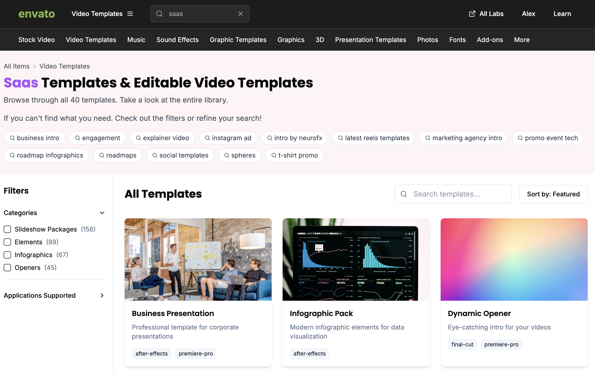
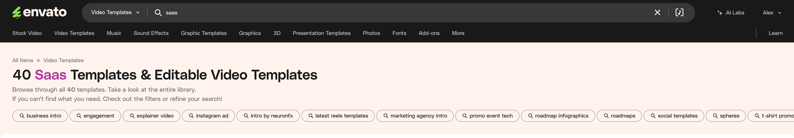

# NextJS Envato Theme 

This project is a test of Bolt.new code copying Envato Theme. This attempt is only created to test Bolt and how detailed it is on each iteration. 



# Here's how i did it
Below the 3 steps to generate the same template or others in the same way. 

Please follow me on [X / Twitter](https://x.com/@alexgenovese) to keep posted on generative code and [RAG](https://alexgenovese.com)


## 1st Step: generate the full site
Print screen of the page (I used a google chrome extension) and start typing the following prompt:

**Start with a simple but detailed request**
```
Write the code for this layout to generate a new nextjs project. Embed Google font typography and Tailwind CSS framework.Add the filtering system of the sidebar and copy all the pattern scheme colour and typography.
```
### The image I uploaded 


## 2nd Step 
It missed the logic behind the filters and the header, but all the job have a look and feel modern and it was a good starting point.

**Below the Prompt I used to add sidebar filters.**
```
Good job! Please add the filters as attached in this image. Write the code to add the layout code and the logic behind the filters. Once I click on checkbox filter, it'll flag true, filter and show the results in the main section on the right showing the images.
```
### The image I uploaded 


## 3rd Step 
The sidebar is fixed and it's working pretty much fine, but the header and subheader are completely wrong. It completely missed the menu generation too.

**Below the Prompt I used to add sidebar header and subheader.**
```
Fine. Update the code adding the header and subheader attached. Please be detailed and use the same color patterns and font types. 
```
### The image I uploaded 



## 4th Step 
Now the header and subheader are generated but it missed the menu (it was generated wrong) and the searchbar was not the same as in the attached screenshot.

**Below the Prompt I used to add sidebar filtering and header.**
```
OK. You missed the menu and searchbar. Copy the exact menu labels and keep design contraints as shown in the file attached. 
```
### The image I uploaded 


# Consideration
Each time I iterate showing the small parts to add the code generated was better and better each time. 

**I noticed that once you request to update it seems that it doesn't have much context** The generated code had issues and it requires to fix each time I updated the code. 

But I'm pretty much sure that it'll be fixed soon. 


## Credits 

[Edit in StackBlitz next generation editor ⚡️](https://stackblitz.com/~/github.com/alexgenovese/envato-theme)

[Generated using Bolt.new](https://bolt.new)
